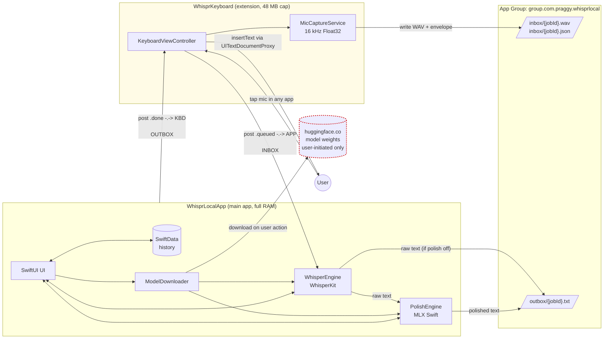

# Architecture

This document describes WhisprLocal's M0 architecture — the minimum coherent
picture a reviewer needs to understand how the two iOS targets interact. It
will evolve as later milestones add real engines inside the same boxes.

The authoritative narrative is `PROJECT_SPEC.md` §2. This page is the visual
companion.

## Processing flow



### Reading the diagram

- **Solid arrows** carry bytes — WAV files, JSON envelopes, text results,
  model weights.
- **Dashed arrows** carry Darwin notifications (process-to-process signals
  posted via `CFNotificationCenterPostNotification`, no payload).
- **Pale-yellow subgraph** is the keyboard extension, which iOS hard-caps at
  ~48 MB of RAM. This is the single most important constraint on the whole
  system's shape.
- **Red dashed border** is the only network dependency. User-initiated model
  downloads from Hugging Face — no other outbound traffic exists or is
  permitted at runtime.
- **`ASR → OUTBOX`** and **`ASR → LLM → OUTBOX`** are both solid, real flows.
  Polish is user-configurable and off-by-default is a valid product state;
  the architecture reflects that.

### Darwin notifications

Darwin notifications use the reverse-DNS pattern
`com.praggy.whisprlocal.job.<event>` where `<event>` is `queued`
(keyboard → app) or `done` (app → keyboard). The diagram uses the short
form (`.queued`, `.done`) for readability. Constants are defined in
`Shared/Sources/WhisprShared/DarwinNotificationNames.swift` — the single
source of truth for the IPC contract. Renaming any constant there silently
breaks the keyboard↔app handoff; treat that file as a stable public API.

## Process boundaries

Three isolation boundaries, each with a distinct memory/permission profile:

| Boundary | RAM ceiling | Network | ML | Purpose |
|---|---|---|---|---|
| **WhisprLocalApp** (main app) | 3–5 GB via `com.apple.developer.kernel.increased-memory-limit` entitlement | Only `huggingface.co` (+ `cdn-lfs.huggingface.co`) via ATS allowlist | Full — WhisperKit (ASR) + MLX Swift (LLM polish) | Recording UI, transcription, polish, history, settings |
| **WhisprKeyboard** (app extension) | ~48 MB iOS-imposed | None at M0 (no runtime network, ever) | **None** — ML imports are a hard ban | Capture audio, hand off to app, insert result via `UITextDocumentProxy` |
| **App Group** (`group.com.praggy.whisprlocal`) | n/a — shared filesystem | n/a | n/a | IPC surface: `inbox/` for jobs, `outbox/` for results |

The 48 MB keyboard ceiling is the constraint that dictates everything else.
If you try to shortcut the architecture by running WhisperKit inside the
extension, the OS kills the process at launch.

## Why this shape?

1. **Keyboards have no background execution and no network without Full
   Access.** So the keyboard's job is bounded: capture audio, serialize,
   signal. It cannot do ML work even if we wanted it to.
2. **The main app has the full RAM budget and is the only process allowed
   to load ML frameworks.** Everything expensive happens here.
3. **The App Group shared container is the only ABI between the two
   targets.** Files and Darwin notifications, nothing else. This keeps the
   coupling thin and testable.
4. **Hugging Face is the only remote.** User-initiated, explicitly
   allow-listed in ATS, disabled at the OS-level for every other domain.
   No telemetry, no analytics, no crash reporting SDKs.

For deeper rationale on the architectural trade-offs, see
`PROJECT_SPEC.md` §2 and the decisions in `docs/DECISIONS.md`.

## M1: Audio capture pipeline (main app)

M1 fills in the `UI` and (partially) the `MIC` boxes above, but with a
caveat: **at M1 the main app also captures**, because the keyboard
extension isn't wired up until M4. The spec explicitly puts M1's capture
path in the main app (§11). The keyboard reuses the same canonical format
at M4 — `Shared/Sources/WhisprShared/AudioFormat.swift` stays the single
source of truth for both.

```
AVAudioEngine.inputNode tap (device-native rate, often 48 kHz stereo)
  │
  ▼
AudioConverter (AVAudioConverter)
  │  → 16 kHz mono Float32
  ▼
AVAudioFile.write(from:)  ← streaming, one tap buffer at a time
  │
  ▼
{App Group}/inbox/{uuid}.wav  (NSFileProtectionComplete)
```

### Threading

- The engine tap closure runs on the real-time audio I/O thread. Inside
  it we only capture immutable `let`-bindings (converter, file box,
  continuation) and dispatch the conversion + file write onto a serial
  `DispatchQueue(qos: .userInitiated)` labelled `…whisprlocal.capture`.
- `AudioCaptureService` is `@Observable @MainActor`; its published `state`
  drives the SwiftUI record screen. `stop()` and `cancel()` await a
  `flushSerialQueue()` before tearing down so no in-flight buffer writes
  race with the file close.
- Level metering uses per-buffer RMS, scaled ×4 and clamped to 0…1, pushed
  into an `AsyncStream<Float>`. The waveform view maintains a fixed-size
  ring of 24 values.

### Privacy invariants (M1)

- Every written WAV has `FileProtectionType.complete` set.
- `inbox/` is created only if `AppGroupPaths.containerURL` resolves (so
  unit tests without entitlements fail fast rather than silently writing
  to a wrong location).
- **Delete-after-consume is a M2 responsibility** (the WhisperEngine
  deletes the WAV once transcription completes — see `PROJECT_SPEC.md`
  §8.6). M1 ends with WAVs persisting in `inbox/` until M2 consumes them;
  this is intentional and documented.
- No network code added. No telemetry. Session category is `.record`
  with mode `.measurement` — no audio playback path.

## M2: Transcription pipeline (main app)

M2 closes the loop from M1's WAV into a visible transcript, and it does
so through the same inbox/envelope/Darwin-notification contract that M4
uses from the keyboard extension. There is **no "fast path" from
AudioCaptureService directly to WhisperEngine** — every transcription
goes through the inbox. This pays upfront architectural cost so M4's
keyboard wiring is a drop-in.

```
            ┌─ stop() ─┐
AudioCaptureService ──▶ inbox/{uuid}.wav          (16 kHz Float32 mono, file-protection complete)
                   └──▶ inbox/{uuid}.json         (JobEnvelope: jobId, createdAt, sourceBundleId, pipeline)
                   └──▶ post "com.praggy.whisprlocal.job.queued"  (Darwin notification)
                                                  │
                                                  │ (dispatch to .userInitiated)
                                                  ▼
                                          InboxJobWatcher
                                          ├─ re-enumerate inbox/ (idempotent — see R8 in M2 plan)
                                          ├─ pair WAV+JSON by stem
                                          └─ per pair, if not in-flight:
                                                │
                                                ▼
                                          WhisperEngine (actor)
                                          ├─ load WhisperKit(variant, modelFolder) lazily
                                          │   - DecodingOptions(supressTokens: [])  ← #392
                                          │   - WhisperKitConfig(prewarm: false)    ← #315
                                          │   - modelFolder under Application Support
                                          └─ transcribe(audioPath:) → TranscriptionResult
                                                │
                                                ▼
                                          TranscriptionOutcome
                                                │
                                                ▼
                                          TranscriptionStore (@Observable, capped at 100)
                                                │
                                                ▼
                                          RecordView.transcriptArea (SwiftUI render)
                                                │
                                                ├─ delete inbox/{uuid}.wav   ◀─ §8.6 cleanup
                                                └─ delete inbox/{uuid}.json     (on success or failure)
```

### Model download flow

```
Settings → Model picker → Download tap
  │
  ▼
ModelStore.download(entry) → ModelDownloading (protocol seam)
  │
  ▼
ModelDownloadService (actor)
  │
  ▼
WhisperKit.download(variant:downloadBase:progressCallback:)
  │
  ▼
huggingface.co / cdn-lfs.huggingface.co   ← only outbound network in the app
  │
  ▼
Application Support/Models/<HubApi-structured tree>
```

Weights live in `Application Support/Models/` — **not** the App Group
container, because the keyboard never loads model weights. Application
Support is excluded from iCloud backup by default and hidden from the
user-visible Files app (R6 in the M2 plan).

### Service graph (main app)

Everything above is wired in `WhisprLocalApp/Core/DI/AppServices.swift`,
instantiated by `@main` and injected into the SwiftUI tree via
`.environment(…)`:

| Service | Role | Isolation |
|---|---|---|
| `ModelCatalog` | Static data from bundled JSON | value type |
| `ModelDownloadService` | WhisperKit download wrapper | `actor` |
| `ModelStore` | Selected model + download state | `@Observable @MainActor` |
| `WhisperEngine` | WhisperKit transcribe wrapper | `actor` |
| `TranscriptionStore` | Outcome log | `@Observable @MainActor` |
| `InboxJobWatcher` | Darwin observer + cleanup | `@MainActor` |

### ADR-002 mitigations in the code

Three upstream-bug workarounds are pinned to call sites. Grep for the
issue IDs to audit them:

- `argmax-oss-swift#392` — `DecodingOptions(supressTokens: [])` in
  `WhisperEngine.makeDecodingOptions()`. Asserted by
  `WhisperEngineMitigationsTests`.
- `argmax-oss-swift#315` — `prewarm: false` + no `prewarmModels()` call
  in `WhisperEngine.makeConfig(for:modelFolderURL:)`. Asserted by the
  same test suite. Swift 5.10 language mode is locked in `project.yml`.
- `argmax-oss-swift#408` — SwiftPM dependency-scan warnings on
  Xcode 26.2. Accepted as build-log noise; CI uses Xcode 16 so this is
  a local-dev-only observation.

### Privacy invariants (M2)

- Only new outbound network: user-initiated model download to the
  ATS-allow-listed HuggingFace domains. No other remote added.
- Weights persist in `Application Support/Models/`; audio stays
  transient in App Group `inbox/` and is deleted by the watcher
  after transcription (§8.6) **even on failure** — leaking failed-WAV
  audio would violate the privacy contract more severely than losing
  a retry.
- No analytics, no crash reporting SDKs added. `CI`'s privacy pattern
  audit covers cloud AI imports, analytics SDKs, and keyboard ML
  imports; all pass.
