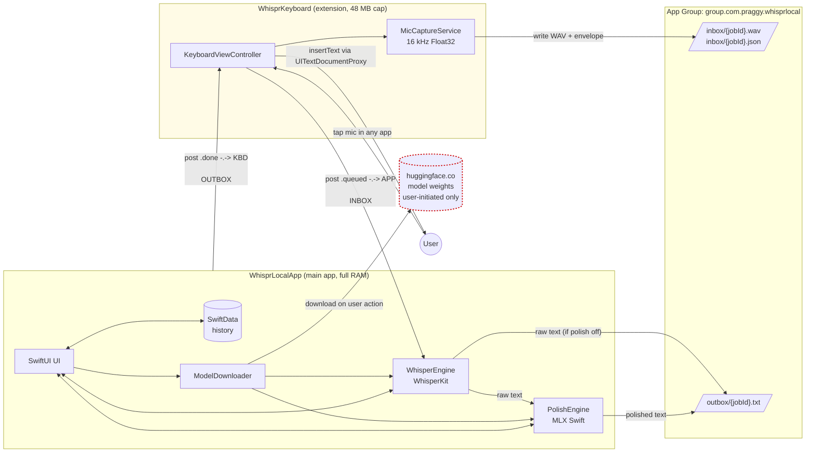

# Architecture

This document describes WhisprLocal's M0 architecture — the minimum coherent
picture a reviewer needs to understand how the two iOS targets interact. It
will evolve as later milestones add real engines inside the same boxes.

The authoritative narrative is `PROJECT_SPEC.md` §2. This page is the visual
companion.

## Processing flow

### Reading the diagram

- **Solid arrows** carry bytes — WAV files, JSON envelopes, text results,
  model weights.
- **Dashed arrows** carry Darwin notifications (process-to-process signals
  posted via `CFNotificationCenterPostNotification`, no payload).
- **Pale-yellow subgraph** is the keyboard extension, which iOS hard-caps at
  ~48 MB of RAM. This is the single most important constraint on the whole
  system's shape.
- **Red dashed border** is the only network dependency. User-initiated model
  downloads from Hugging Face — no other outbound traffic exists or is
  permitted at runtime.
- **`ASR → OUTBOX`** and **`ASR → LLM → OUTBOX`** are both solid, real flows.
  Polish is user-configurable and off-by-default is a valid product state;
  the architecture reflects that.

### Darwin notifications

Darwin notifications use the reverse-DNS pattern
`com.praggy.whisprlocal.job.<event>` where `<event>` is `queued`
(keyboard → app) or `done` (app → keyboard). The diagram uses the short
form (`.queued`, `.done`) for readability. Constants are defined in
`Shared/Sources/WhisprShared/DarwinNotificationNames.swift` — the single
source of truth for the IPC contract. Renaming any constant there silently
breaks the keyboard↔app handoff; treat that file as a stable public API.

## Process boundaries

Three isolation boundaries, each with a distinct memory/permission profile:

| Boundary | RAM ceiling | Network | ML | Purpose |
|---|---|---|---|---|
| **WhisprLocalApp** (main app) | 3–5 GB via `com.apple.developer.kernel.increased-memory-limit` entitlement | Only `huggingface.co` (+ `cdn-lfs.huggingface.co`) via ATS allowlist | Full — WhisperKit (ASR) + MLX Swift (LLM polish) | Recording UI, transcription, polish, history, settings |
| **WhisprKeyboard** (app extension) | ~48 MB iOS-imposed | None at M0 (no runtime network, ever) | **None** — ML imports are a hard ban | Capture audio, hand off to app, insert result via `UITextDocumentProxy` |
| **App Group** (`group.com.praggy.whisprlocal`) | n/a — shared filesystem | n/a | n/a | IPC surface: `inbox/` for jobs, `outbox/` for results |

The 48 MB keyboard ceiling is the constraint that dictates everything else.
If you try to shortcut the architecture by running WhisperKit inside the
extension, the OS kills the process at launch.

## Why this shape?

1. **Keyboards have no background execution and no network without Full
   Access.** So the keyboard's job is bounded: capture audio, serialize,
   signal. It cannot do ML work even if we wanted it to.
2. **The main app has the full RAM budget and is the only process allowed
   to load ML frameworks.** Everything expensive happens here.
3. **The App Group shared container is the only ABI between the two
   targets.** Files and Darwin notifications, nothing else. This keeps the
   coupling thin and testable.
4. **Hugging Face is the only remote.** User-initiated, explicitly
   allow-listed in ATS, disabled at the OS-level for every other domain.
   No telemetry, no analytics, no crash reporting SDKs.

For deeper rationale on the architectural trade-offs, see
`PROJECT_SPEC.md` §2 and the decisions in `docs/DECISIONS.md`.
